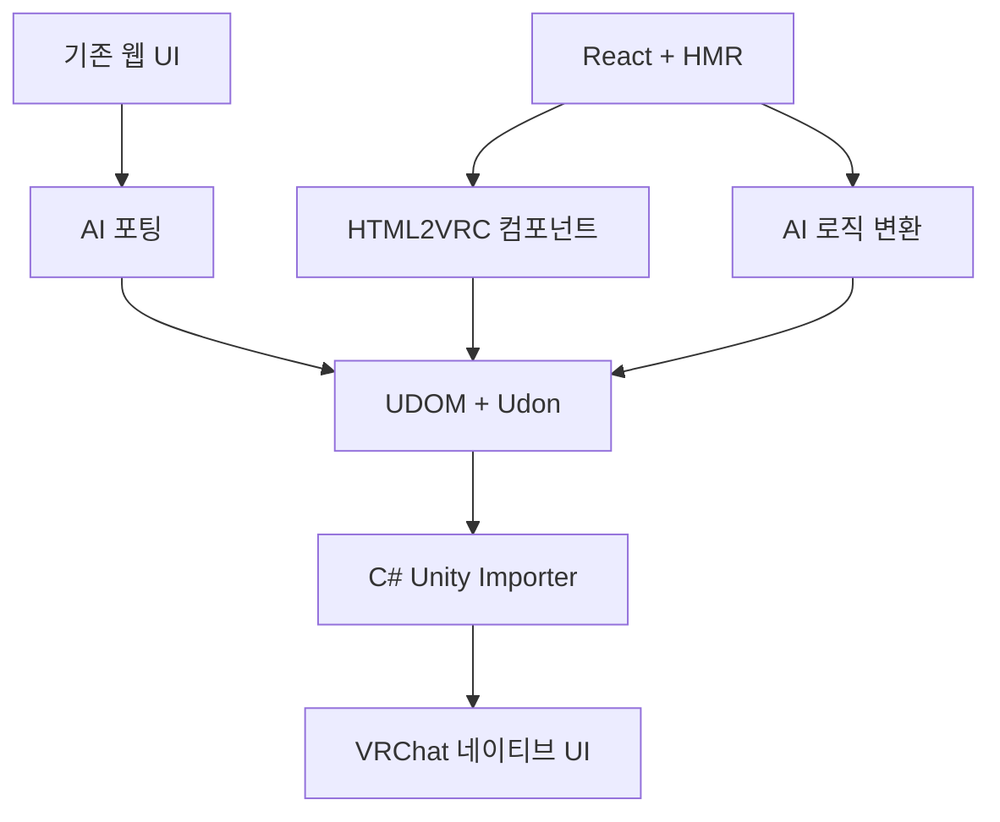

# HTML2VRC

> 웹에서 디자인하고, VRChat에서 네이티브로 실행합니다.

HTML2VRC는 웹 기술로 제작한 인터페이스를 수정 가능한 VRChat 월드 네이티브 UI로 옮기기 위한 초기 단계의 프로젝트입니다.

웹은 AI 친화적인 디자인 환경으로만 사용하며 런타임으로 포함하지 않습니다. 최종 결과물은 Unity UI, TextMeshPro, 에셋과 Udon으로 구성되며, 월드 안에는 브라우저, WebView, React 또는 Node.js가 들어가지 않습니다.

> [!IMPORTANT]
> HTML2VRC는 현재 설계 및 프로토타입 단계입니다. 아직 사용할 수 있는 릴리스가 없습니다.

## 왜 HTML2VRC인가요?

AI는 HTML, CSS, React와 이미 성숙한 디자인 시스템을 이용해 완성도 높은 웹 UI를 만들 수 있습니다. 그러나 같은 결과물을 VRChat 월드에서 직접 만들려면 레이아웃, 텍스트, 인터랙션, Unity 계층과 Udon을 VRChat의 제약 안에서 함께 구성해야 합니다.

HTML2VRC는 **UDOM**이라는 공통 중간 표현을 이용해 웹 제작 환경과 Unity 사이의 간극을 줄이는 것을 목표로 합니다.

## 두 가지 제작 흐름

### 기존 웹 UI 포팅

기존 웹사이트, HTML 또는 기준 이미지를 AI에 제공합니다. AI는 화면의 시각적 구조를 UDOM으로 재구성하고, 필요한 인터랙션을 Udon 또는 UdonSharp로 변환합니다.

생성된 UDOM과 에셋은 Unity에서 바로 가져올 수 있습니다. 이 흐름에는 **Node.js가 필요하지 않습니다.**

### React로 새 VRChat UI 제작

`@html2vrc/react`를 이용해 새 인터페이스를 만들고, 브라우저 HMR로 디자인을 빠르게 확인하고 수정합니다. React의 상태와 인터랙션 로직은 AI가 Udon 또는 UdonSharp로 변환합니다.

이 선택적 저작 환경에는 Node.js가 필요하지만, 생성된 Unity 프로젝트와 최종 VRChat 월드에는 필요하지 않습니다.

## 전체 구조

React에서 UDOM으로의 변환 전체를 결정론적인 변환 문제로 취급하지 않습니다. React에는 상태, 조건부 렌더링, Hooks, 반복과 임의의 이벤트 로직이 포함될 수 있기 때문입니다.

HTML2VRC는 UI 컴포넌트를 제한해 각 요소의 의미를 명확히 하고, 의미 해석이 필요한 부분에는 AI를 사용합니다. 결정론적인 핵심 과정은 **UDOM → Unity**에서 시작합니다.

## Node.js는 선택 사항입니다

Unity 패키지는 C# Editor 도구만으로 UDOM을 가져오도록 설계합니다.

| 사용 흐름               | Node.js 필요 여부 |
| ------------------- | ------------: |
| UDOM을 Unity로 가져오기   |           불필요 |
| AI로 포팅된 기존 웹 UI 사용  |           불필요 |
| React와 HMR로 새 UI 제작 |            필요 |
| 최종 VRChat 월드 실행     |           불필요 |

JavaScript 개발 환경을 사용하지 않는 VRChat 제작자도 기존 웹 포팅 결과를 이용할 수 있도록 하는 것이 목표입니다.

## 네이티브 우선 렌더링

HTML2VRC는 가능한 요소를 Unity 엔진에서 직접 표현합니다.

* 텍스트는 TextMeshPro로 만듭니다.
* 패널과 컨트롤은 Unity UI로 만듭니다.
* 스크롤과 입력은 Unity 컴포넌트를 사용합니다.
* 사진과 일러스트는 Texture 또는 Sprite로 유지합니다.
* 복잡한 장식은 부분 이미지로 Bake할 수 있습니다.
* 외부 월드 시스템은 Embed Binding으로 연결합니다.

빠른 포팅이나 폴백을 위해 화면 전체를 이미지로 사용할 수도 있습니다. 다만 텍스트까지 스크린샷에 포함하면 VR에서 선명도가 떨어질 수 있으므로 가능한 텍스트는 TextMeshPro로 분리합니다.

HTML2VRC는 폰트 크기, 간격, 대비 또는 인터랙션 밀도를 자동으로 변경하지 않습니다. 이는 월드 제작자가 결정할 영역이며, VR 사용성에 관한 권장 사항은 제작 가이드와 AI 프롬프트로 제공할 수 있습니다.

## UDOM

UDOM은 두 제작 흐름과 Unity가 공유하는 중간 표현입니다.

UDOM은 VRChat 월드에서 UI를 재현하는 데 필요한 정보를 표현합니다.

* UI 계층과 레이아웃
* 시각 속성과 에셋
* 텍스트 렌더링 방식
* 컨트롤과 인터랙션 Binding
* 재생성을 위한 안정적인 식별자
* 외부 GameObject를 위한 Embed 지점

사람이 읽을 수 있고, AI가 생성하거나 수정할 수 있으며, Node.js 없이 Unity로 가져올 수 있는 형식을 목표로 합니다.

UDOM 안에는 임의의 JavaScript를 저장하지 않습니다. 웹 로직은 Udon 또는 UdonSharp로 변환하고, UDOM은 생성된 동작과 UI 요소 사이의 연결을 표현합니다.

## Embed

Embed는 HTML2VRC 레이아웃에 기존 Unity GameObject나 VRChat 프리팹을 연결합니다. 연결된 오브젝트의 내부 구조는 HTML2VRC가 소유하지 않습니다.

예를 들어 웹의 비디오 iframe은 VizVid나 YAMA Player 같은 VRChat 네이티브 비디오 플레이어와 연결할 수 있습니다.

HTML2VRC는 배치와 Binding을 관리하며, 외부 에셋은 독립적으로 수정할 수 있고 UI를 재생성해도 유지되어야 합니다.

## 프로젝트 범위

HTML2VRC는 다음을 목표로 하지 않습니다.

* VRChat용 WebView 또는 브라우저
* 월드 안에서 일반 웹사이트 탐색
* 모든 HTML과 CSS의 완전한 호환
* 범용 JavaScript-to-Udon 변환기
* 브라우저 렌더링과 픽셀 단위로 동일한 결과
* 자동 VR 디자인 교정

웹 UI의 구조, 시각적 정체성과 유용한 인터랙션을 유지하면서 현실적으로 사용할 수 있는 VRChat 네이티브 결과물을 만드는 것이 목표입니다.

## 예정된 패키지

| 구성           | 이름                    |
| ------------ | --------------------- |
| Unity 패키지    | `com.nupamo.html2vrc` |
| React 저작 SDK | `@html2vrc/react`     |
| 중간 표현        | `UDOM`                |

## 로드맵

### 0. UDOM에서 Unity까지

* 최소한의 UDOM 범위를 정의합니다.
* C# Unity Importer를 만듭니다.
* Canvas, TextMeshPro, 버튼과 스크롤을 생성합니다.
* VRChat Build & Test에서 결과를 확인합니다.

### 1. 재생성 가능한 UI

* 안정적인 식별자를 추가합니다.
* Binding과 사용자 소유 오브젝트를 보존합니다.
* 지원하지 않는 요소를 명확하게 알립니다.
* 기본 에셋과 시각 스타일을 지원합니다.

### 2. React 저작 환경

* HTML2VRC 컴포넌트를 만듭니다.
* 브라우저 미리보기와 HMR을 제공합니다.
* UDOM으로 옮길 수 있는 시각 결과물을 만듭니다.
* React 인터랙션 하나를 AI로 UdonSharp에 변환합니다.

### 3. 기존 웹 포팅

* 웹사이트와 스크린샷 분석을 위한 AI 가이드를 만듭니다.
* 기존 인터페이스에서 검증 가능한 UDOM을 생성합니다.
* 지원 가능한 웹 인터랙션을 VRChat용으로 재해석합니다.
* 원본 디자인과 Unity 결과물을 비교합니다.

### 4. 시각 품질

* 패널, 테두리, 아이콘과 텍스트 레이아웃을 개선합니다.
* 브라우저 기준 이미지와 Unity 결과물을 비교합니다.
* PC와 Quest 성능을 확인합니다.

### 5. 확장

* Embed Adapter를 추가합니다.
* 사용자 정의 컴포넌트를 지원합니다.
* 다른 프론트엔드 어댑터를 검토합니다.
* 패키지, 예제와 제작 가이드를 공개합니다.

## 첫 번째 목표

첫 구현 대상은 작은 음악 플레이어나 월드 설정 패널입니다.

* TextMeshPro로 렌더링되는 텍스트
* 버튼과 스크롤 목록
* 하나의 Udon 동작
* 하나의 외부 GameObject Embed
* Binding을 보존하는 재생성
* Node.js가 전혀 필요 없는 UDOM → Unity 경로

먼저 공통 Unity Core를 검증한 뒤 React 저작 환경과 기존 웹 AI 포팅을 연결합니다.

## 현재 상태

HTML2VRC는 현재 아키텍처, UDOM 범위와 첫 번째 수직 프로토타입을 정의하고 있습니다.

현재 우선순위는 다음과 같습니다.

1. 최소 UDOM 문서를 정의합니다.
2. Unity 내부에서 C#으로 가져옵니다.
3. 실제로 동작하는 VRChat UI를 생성합니다.
4. Node.js가 필요하지 않은지 확인합니다.
5. 그 위에 React 저작 환경과 AI 포팅을 추가합니다.

## 첫 번째 기술 검증 프로토타입

`prototype` 브랜치에는 UDOM 0.1 JSON을 Unity 네이티브 UI로 만드는 수직 프로토타입이 포함되어 있습니다.

### 요구 환경

- Unity `2022.3.22f1`
- TextMeshPro `3.0.6`
- Unity UI `1.0.0`
- Node.js 불필요

이 저장소 자체에는 VRChat Worlds SDK와 UdonSharp를 설치하지 않았습니다. SDK가 없는 상태에서도 구조를 검증할 수 있도록 안전 동작은 현재 Unity `MonoBehaviour`로 실행됩니다.

### 1분 사용법

1. Unity Hub에서 이 저장소 폴더를 Unity `2022.3.22f1` 프로젝트로 엽니다.
2. Unity가 패키지 가져오기와 컴파일을 끝낼 때까지 기다립니다.
3. `Assets/Html2Vrc/Samples/WorldSettings.udom.json`을 선택합니다.
4. `Tools > HTML2VRC > UDOM Importer`를 엽니다.
5. `Validate`를 누른 뒤 `Generate / Regenerate`를 누릅니다.
6. 생성된 Canvas의 `UdomGeneratedRoot > External References`에서 `world-light` 슬롯에 원하는 Light GameObject를 드래그합니다.
7. Play Mode에서 `Toggle World Light`와 `Close Panel` 버튼을 누릅니다.

완성된 예제를 바로 보려면 `Tools > HTML2VRC > Build Sample World Settings Scene`을 실행합니다. `Assets/Html2Vrc/Samples/WorldSettingsSample.unity`에 Camera, Light, 외부 연결과 생성 UI가 포함된 샘플 Scene이 저장됩니다.

### 재생성 확인

1. 샘플 JSON의 `title.text` 또는 `settings-panel.style.backgroundColor`를 바꿉니다.
2. Importer에서 같은 파일로 `Generate / Regenerate`를 다시 실행합니다.
3. 기존 안정 ID의 GameObject가 갱신되고 `world-light` 외부 참조는 유지되는지 확인합니다.
4. Hierarchy에서 생성 마커가 없는 사용자 GameObject를 Canvas 아래 추가해도 재생성 시 삭제되지 않습니다.

### 문서와 코드

- 최소 규격: `Assets/Html2Vrc/Documentation/UDOM_SPEC.md`
- 샘플 JSON: `Assets/Html2Vrc/Samples/WorldSettings.udom.json`
- Importer: `Assets/Html2Vrc/Editor/UdomImporterWindow.cs`
- 재생성 빌더: `Assets/Html2Vrc/Editor/UdomBuilder.cs`
- 안전 동작: `Assets/Html2Vrc/Runtime/UdomSafeAction.cs`
- UdonSharp 경계: `Assets/Html2Vrc/Documentation/UDONSHARP_BOUNDARY.md`
- 실제 테스트 결과: `Assets/Html2Vrc/Documentation/TEST_RESULTS.md`
- EditMode 테스트: `Assets/Html2Vrc/Tests/Editor/UdomPrototypeTests.cs`

### 현재 한계

- HTML/CSS/React/JavaScript를 읽지 않습니다.
- UDOM 0.1의 제한된 요소와 스타일만 지원합니다.
- Sprite는 Unity 프로젝트의 `Assets/` 경로만 참조합니다.
- 사용자 오브젝트는 보존하지만, 생성 마커가 붙은 오브젝트에서 생성기가 소유하는 UI 컴포넌트를 다른 타입으로 바꾸면 다음 재생성 때 원래 타입에 맞게 복구됩니다.
- VRChat Build & Test, UdonSharp 컴파일, ClientSim, 네트워크 동기화는 이 저장소에 SDK가 없어 아직 검증 대상이 아닙니다.
