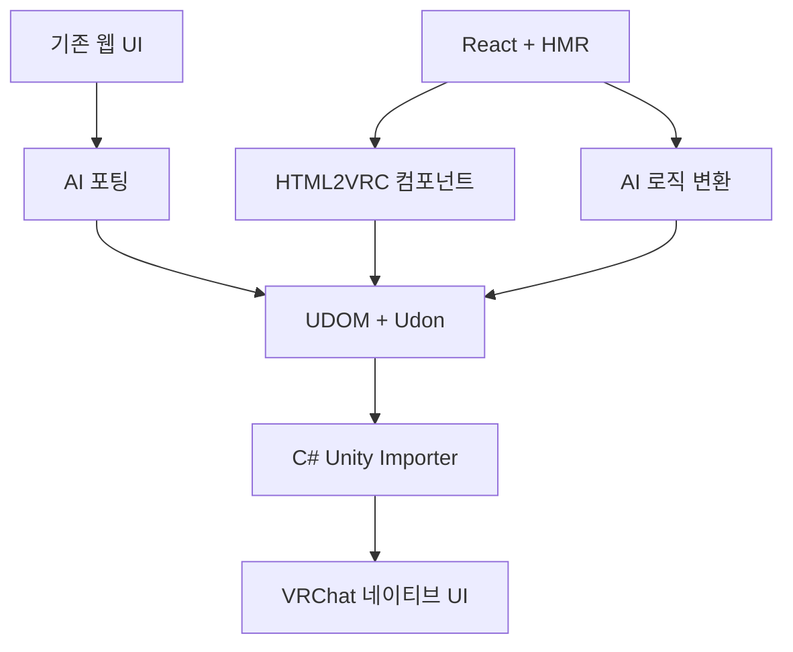

# HTML2VRC

> 웹에서 디자인하고, VRChat에서 네이티브로 실행합니다.

HTML2VRC는 웹 기술로 제작한 인터페이스를 수정 가능한 VRChat 월드 네이티브 UI로 옮기기 위한 초기 단계의 프로젝트입니다.

웹은 AI 친화적인 디자인 환경으로만 사용하며 런타임으로 포함하지 않습니다. 최종 결과물은 Unity UI, TextMeshPro, 에셋과 Udon으로 구성되며, 월드 안에는 브라우저, WebView, React 또는 Node.js가 들어가지 않습니다.

> [!IMPORTANT]
> HTML2VRC는 현재 기술 검증 프로토타입 단계입니다. UDOM에서 VRChat 월드 번들까지의 첫 수직 경로는 동작하지만, 아직 사용할 수 있는 제품 릴리스는 없습니다.

## 왜 HTML2VRC인가요?

AI는 HTML, CSS, React와 이미 성숙한 디자인 시스템을 이용해 완성도 높은 웹 UI를 만들 수 있습니다. 그러나 같은 결과물을 VRChat 월드에서 직접 만들려면 레이아웃, 텍스트, 인터랙션, Unity 계층과 Udon을 VRChat의 제약 안에서 함께 구성해야 합니다.

HTML2VRC는 **UDOM**이라는 공통 중간 표현을 이용해 웹 제작 환경과 Unity 사이의 간극을 줄이는 것을 목표로 합니다.

## 두 가지 제작 흐름

### 기존 웹 UI 포팅

기존 웹사이트, HTML 또는 기준 이미지를 AI에 제공합니다. AI는 화면의 시각적 구조를 UDOM으로 재구성하고, 필요한 인터랙션을 Udon 또는 UdonSharp로 변환합니다.

생성된 UDOM과 에셋은 Unity에서 바로 가져올 수 있습니다. 이 흐름에는 **Node.js가 필요하지 않습니다.**

### React로 새 VRChat UI 제작

`@html2vrc/react`를 이용해 새 인터페이스를 만들고, 브라우저 HMR로 디자인을 빠르게 확인하고 수정합니다. React의 상태와 인터랙션 로직은 AI가 Udon 또는 UdonSharp로 변환합니다.

이 선택적 저작 환경에는 Node.js가 필요하지만, 생성된 Unity 프로젝트와 최종 VRChat 월드에는 필요하지 않습니다.

## 전체 구조



React에서 UDOM으로의 변환 전체를 결정론적인 변환 문제로 취급하지 않습니다. React에는 상태, 조건부 렌더링, Hooks, 반복과 임의의 이벤트 로직이 포함될 수 있기 때문입니다.

HTML2VRC는 UI 컴포넌트를 제한해 각 요소의 의미를 명확히 하고, 의미 해석이 필요한 부분에는 AI를 사용합니다. 결정론적인 핵심 과정은 **UDOM → Unity**에서 시작합니다.

## Node.js는 선택 사항입니다

Unity 패키지는 C# Editor 도구만으로 UDOM을 가져오도록 설계합니다.

| 사용 흐름               | Node.js 필요 여부 |
| ------------------- | ------------: |
| UDOM을 Unity로 가져오기   |           불필요 |
| AI로 포팅된 기존 웹 UI 사용  |           불필요 |
| React와 HMR로 새 UI 제작 |            필요 |
| 최종 VRChat 월드 실행     |           불필요 |

JavaScript 개발 환경을 사용하지 않는 VRChat 제작자도 기존 웹 포팅 결과를 이용할 수 있도록 하는 것이 목표입니다.

## 네이티브 우선 렌더링

HTML2VRC는 가능한 요소를 Unity 엔진에서 직접 표현합니다.

* 텍스트는 TextMeshPro로 만듭니다.
* 패널과 컨트롤은 Unity UI로 만듭니다.
* 스크롤과 입력은 Unity 컴포넌트를 사용합니다.
* 사진과 일러스트는 Texture 또는 Sprite로 유지합니다.
* 복잡한 장식은 부분 이미지로 Bake할 수 있습니다.
* 외부 월드 시스템은 Embed Binding으로 연결합니다.

빠른 포팅이나 폴백을 위해 화면 전체를 이미지로 사용할 수도 있습니다. 다만 텍스트까지 스크린샷에 포함하면 VR에서 선명도가 떨어질 수 있으므로 가능한 텍스트는 TextMeshPro로 분리합니다.

HTML2VRC는 폰트 크기, 간격, 대비 또는 인터랙션 밀도를 자동으로 변경하지 않습니다. 이는 월드 제작자가 결정할 영역이며, VR 사용성에 관한 권장 사항은 제작 가이드와 AI 프롬프트로 제공할 수 있습니다.

## UDOM

UDOM은 두 제작 흐름과 Unity가 공유하는 중간 표현입니다.

UDOM은 VRChat 월드에서 UI를 재현하는 데 필요한 정보를 표현합니다.

* UI 계층과 레이아웃
* 시각 속성과 에셋
* 텍스트 렌더링 방식
* 컨트롤과 인터랙션 Binding
* 재생성을 위한 안정적인 식별자
* 외부 GameObject를 위한 Embed 지점

사람이 읽을 수 있고, AI가 생성하거나 수정할 수 있으며, Node.js 없이 Unity로 가져올 수 있는 형식을 목표로 합니다.

UDOM 안에는 임의의 JavaScript를 저장하지 않습니다. 웹 로직은 Udon 또는 UdonSharp로 변환하고, UDOM은 생성된 동작과 UI 요소 사이의 연결을 표현합니다.

Unity Importer는 `packages/udom`의 canonical UDOM 0.1과 기존 Unity 프로토타입 JSON 프로필을 모두 자동 감지합니다. `@html2vrc/react`의 기본·컨트롤 fixture와 공식 UDOM settings fixture는 별도 변환 스크립트 없이 동일한 Unity 생성 경로로 들어갑니다. React exporter와 Unity importer 모두 view, text, image, button, toggle, slider, text-input, scroll과 embed를 연결했습니다. 지원하지 않는 canonical 표현은 묵시하지 않고 검증 오류나 손실 내용이 들어 있는 안전한 폴백 경고로 반환합니다.

Canonical resource URI는 UDOM TextAsset 폴더를 기준으로 안전하게 해석합니다. image resource는 Texture2D/RawImage, sprite resource는 Sprite/Image로 매핑하며, 정규화된 경로가 Unity `Assets/` 밖으로 나가면 참조를 거부합니다.

Canonical scroll은 `vertical`, `horizontal`, `both` 축을 native ScrollRect로 생성하고, 왼쪽 위 기준 design-unit `initialOffset`을 Unity 콘텐츠 좌표로 변환합니다.

UDOM Importer의 `Override Target Canvas`에서 Renderer 목표 크기를 지정하면 canonical `viewport.fit`의 `contain`, `cover`, `stretch`, `none`을 안정적인 내부 viewport wrapper에 적용합니다. `cover`와 넘칠 수 있는 `none`은 목표 영역에서 클리핑됩니다.

Canonical `paint.visible`과 `paint.opacity`는 CanvasGroup으로 자식 전체에 합성됩니다. 숨김 상태도 GameObject와 레이아웃은 유지하며 입력만 차단하고, 기존 사용자 CanvasGroup이 있으면 원래 설정을 보존한 채 opacity를 곱합니다.

Canonical 2D transform은 `origin`과 배열 순서의 `translate`, `rotate`, `scale`을 지원합니다. Unity Importer는 각 operation을 안정 ID의 RectTransform wrapper로 분리해 비균일 scale이 섞인 순서도 보존하고, transform과 percentage 기준은 최종 Layout Rect에 맞춰 갱신합니다. Transform은 형제의 flex 배치 공간을 바꾸지 않습니다.

제한형 HTML의 `transform-origin`과 `translate`·`translateX/Y`·`rotate`·`scale`·`scaleX/Y`도 같은 wrapper 경로를 사용합니다. CSS 함수의 오른쪽부터 적용되는 순서를 canonical 배열에 맞게 변환하고, `transform: none` 전환에서는 기존 노드를 유지하면서 wrapper만 정리합니다.

Canonical layout의 `minWidth`, `minHeight`, `maxWidth`, `maxHeight`, `aspectRatio`를 지원합니다. 숫자와 percentage 제약은 부모의 design box에서 해석하고, 한 축이 `auto`인 aspect ratio는 반대 축과 min/max를 함께 만족하도록 계산합니다. 제약이 있는 flex 행·열은 max에 닿은 grow 공간을 남은 항목에 재분배하며, cross-axis stretch도 항목별 min/max를 지킨 고정 Unity Rect로 생성합니다.

제한형 HTML도 px `min/max-width/height`, `max-*: none`, `aspect-ratio`의 숫자·`width / height` 형식과 한 축 `auto`를 같은 constraint resolver로 처리합니다. Min/max에 닿은 HTML flex item을 고정한 뒤 남은 grow 공간도 다른 항목에 재분배합니다.

Canonical layout의 `overflowX`와 `overflowY`가 모두 `hidden`이면 VRChat-safe `RectMask2D`로 자식 콘텐츠를 양축에서 자릅니다. 다시 `visible`로 바꾸면 같은 GameObject를 유지한 채 마스크만 제거합니다. 한 축만 hidden인 조합과 일반 노드의 `scroll`은 Unity 기본 클리퍼로 정확히 표현할 수 없어 명시적 검증 오류로 반환합니다.

Canonical flex item의 `grow`, 기본값 1인 `shrink`, 숫자·percentage·`auto` `basis`를 지원합니다. Basis에서 시작한 여유 공간은 grow 비율로, 부족한 공간은 `shrink × basis` 비율로 나누며 min/max에 닿은 항목을 고정한 뒤 나머지 항목에 재분배합니다. Margin과 gap은 줄이지 않고, 활성 Scroll 축은 콘텐츠 overflow를 유지합니다.

Canonical flex의 `wrap`과 `wrap-reverse`, `alignContent`, `rowGap`과 `columnGap`도 지원합니다. Importer는 항목을 안정적으로 line에 나눈 뒤 line별 grow/shrink와 justify, 항목별 alignSelf, line 묶음의 교차축 정렬을 계산하고 최종 top-left Rect로 생성하므로 Unity 재생성 결과가 결정론적으로 유지됩니다.

제한형 HTML 입력도 `flex-wrap`, `align-content`, `gap`, `row-gap`, `column-gap`을 같은 canonical multi-line 해석기로 처리합니다. CSS 두 값 `gap`은 row·column 순서로 보존하며, wrap에서 nowrap으로 전환해도 기존 생성 GameObject를 재사용합니다.

제한형 HTML의 `overflow`, `overflow-x`, `overflow-y`도 CSS source-order로 해석합니다. 최종 양축이 hidden이면 canonical 경로와 같은 `RectMask2D`를 사용하고, 양축 visible로 복원하면 기존 노드와 자식을 유지한 채 마스크만 제거합니다.

Canonical flex item의 `alignSelf`는 `auto`, `start`, `center`, `end`, `stretch`를 지원합니다. 개별 항목이 부모의 `alignItems`를 교차축에서 override하고, 기존 margin과 min/max 제약을 보존하며, overflow가 있어도 canonical start 기준을 유지합니다. Unity에서는 기존 안정 margin wrapper를 재사용하므로 정렬을 바꿔 재생성해도 원본 GameObject와 transform·shadow 계층이 유지됩니다.

Canonical flex의 `justify`는 `start`, `center`, `end`, `space-between`, `space-around`, `space-evenly`를 지원합니다. 고정 gap을 먼저 적용한 뒤 남은 주축 공간을 정렬 또는 분배하고, reverse 방향에서는 canonical main-start/main-end가 뒤집힌 물리 좌표와 안정 형제 순서에 함께 반영됩니다.

Canonical flex의 `row-reverse`, `column-reverse`, 정수 `flexItem.order`를 지원합니다. 항목은 `(order, 원본 자식 순서)`로 안정 정렬하고 reverse 방향의 main-start에서 배치하며, margin·transform·shadow wrapper가 있어도 같은 GameObject와 안정 ID를 재사용합니다.

Canonical `position: absolute` 항목은 부모 flex의 크기 분배와 gap에서 제외하고, `x/y`를 부모 design box의 왼쪽·위 기준 숫자 또는 percentage 좌표로 배치합니다. 직접 노드와 margin·transform·shadow wrapper 모두 같은 top-left anchor 규칙을 사용하며 absolute와 flow 사이를 재생성해도 안정 GameObject를 유지합니다.

Canonical `zIndex`는 같은 부모 안에서 낮은 값부터 높은 값 순으로 그리며 동률은 기존 시각 순서를 유지합니다. z-index가 섞인 flex 컨테이너는 위치를 먼저 결정론적인 top-left Rect로 계산한 뒤 margin·transform·shadow의 가장 바깥 wrapper를 paint 순서로 재배치하므로 `order`, reverse, grow/shrink와 absolute 제외 규칙이 바뀌지 않습니다.

Canonical `layout.mode: none`은 해당 노드와 전체 subtree를 Unity hierarchy, flex 공간, gap과 신규 binding slot 수집에서 제외합니다. 이전에 생성된 subtree는 재생성 시 안정 ID 기준으로 모두 정리하되, 사용자가 연결한 외부 slot target 자체는 삭제하거나 reparent하지 않습니다. 생략된 mode는 명세 기본값인 `absolute`로 처리합니다.

Canonical text의 `lineHeight`, `letterSpacing`, justify 정렬, wrap/nowrap, visible/clip/ellipsis overflow와 `preserveWhitespace`를 TextMeshPro로 보존합니다. 절대 line height는 실제 TMP FontAsset metric에서 spacing을 역산하고, letter spacing은 design unit을 TMP em 단위로 변환합니다. 생략된 canonical 텍스트는 명세 기본값인 16px, 검정, top/start, wrap, clip을 사용합니다.

Canonical font resource가 Unity `Assets/` 안의 기존 TMP Font Asset을 가리키면 그대로 사용합니다. TTF 또는 OTF 원본을 가리키면 source GUID 기반 안정 경로의 dynamic TMP Font Asset을 `Assets/Html2VrcGenerated/Fonts`에 생성해 Text와 TextInput에서 재사용합니다. 경로가 없거나 지원하지 않는 형식이면 진단을 남기고 TMP Settings의 기본 font로 폴백합니다.

Canonical image의 `fit`은 `fill`, `contain`, `cover`, `none`을 지원합니다. 이미지 콘텐츠는 안정 ID를 가진 내부 자식에 배치되고 원본 비율·크기와 `position.x/y`에 따라 정렬되며, 노드 영역을 넘는 부분은 마스크로 잘립니다. 백분율 위치는 남는 공간에 대한 비율, 숫자는 왼쪽·위 기준 design-unit 오프셋, `auto`는 가운데 정렬로 해석합니다.

제한형 HTML의 ``도 Unity `Assets/` 아래 Texture2D와 Sprite를 자동 구분하고, CSS `object-fit: fill | contain | cover | none`과 1~2값 `object-position`을 같은 이미지 콘텐츠 경로로 변환합니다. 위치에는 px·percentage와 `left`, `center`, `right`, `top`, `bottom` 키워드를 사용할 수 있습니다.

Canonical `paint.border`의 왼쪽·위·오른쪽·아래 `solid` edge는 각 폭과 색을 유지한 단일 VRChat-safe SDF Image로 생성됩니다. Outer radius와 비대칭 폭에서 계산한 타원형 inner corner를 함께 사용하고, 서로 다른 edge 색은 폭 비율의 diagonal join으로 연결됩니다. 안정 border Material과 overlay는 레이아웃·raycast에 영향을 주지 않으며 재생성 사이에 GUID와 GameObject를 유지합니다.

Canonical `linear-gradient`는 임의 각도와 여러 color stop을 보존해 Unity UI 전용 Material로 생성됩니다. 색상은 1025×1 LUT Texture에 결정론적으로 기록되고, 노드 크기와 각도를 전달받는 VRChat 호환 Shader가 이를 렌더링합니다. UDOM TextAsset에서 생성할 때 Material과 LUT는 `Assets/Html2VrcGenerated/Gradients` 아래 안정 경로에 재사용되며, 월드 계층에는 별도 사용자 런타임 컴포넌트를 추가하지 않습니다.

Canonical `radial-gradient`도 같은 LUT를 사용하며 `center.x/y`와 타원형 `radius.x/y`의 design-unit·percentage 혼합을 보존합니다. percentage는 최종 Unity Rect의 각 축을 기준으로 다시 계산되므로 flex 또는 Canvas 크기가 바뀌어도 중심과 타원 경계가 맞게 유지됩니다.

Canonical `conic-gradient`는 기본 0°의 위쪽 선에서 시작해 시계 방향으로 LUT를 순회합니다. 사용자 지정 center와 시작 각도를 보존하며 radial/linear gradient와 같은 안정 Material·Texture 경로를 재사용합니다.

Canonical `paint.radius`는 네 모서리 값을 보존한 해상도 독립 SDF Material로 생성됩니다. 인접 radius 합이 박스 변보다 크면 비율을 유지한 채 자동 축소되며, image와 자식 콘텐츠는 Unity stencil `Mask`로 같은 곡선에 잘립니다. 단색과 linear/radial/conic gradient 모두 radius를 함께 사용할 수 있고, 생성 Material은 `Assets/Html2VrcGenerated/RoundedCorners` 아래 안정 경로로 재사용됩니다.

Canonical shadow는 여러 outer·inset 레이어의 offset, blur, spread, color를 radius와 함께 VRChat-safe SDF Material로 렌더링합니다. Outer shadow의 안정 wrapper는 원래 Layout 공간 밖에서 그려지고 transform을 함께 상속하므로 flex 배치나 클릭 영역을 바꾸지 않습니다. Inset shadow는 노드 배경 위·콘텐츠 아래의 `ignoreLayout` 레이어로 생성되고 박스 radius 안에서 잘리며, transform과 opacity를 노드와 함께 상속합니다.

## Embed

Embed는 HTML2VRC 레이아웃에 기존 Unity GameObject나 VRChat 프리팹을 연결합니다. 연결된 오브젝트의 내부 구조는 HTML2VRC가 소유하지 않습니다.

예를 들어 웹의 비디오 iframe은 VizVid나 YAMA Player 같은 VRChat 네이티브 비디오 플레이어와 연결할 수 있습니다.

HTML2VRC는 배치와 Binding을 관리하며, 외부 에셋은 독립적으로 수정할 수 있고 UI를 재생성해도 유지되어야 합니다.

Canonical Embed의 `fallbackLabel`은 외부 슬롯이 비어 있을 때 TextMeshPro로 표시되고, 참조가 연결되면 자동으로 숨겨집니다.

## 프로젝트 범위

HTML2VRC는 다음을 목표로 하지 않습니다.

* VRChat용 WebView 또는 브라우저
* 월드 안에서 일반 웹사이트 탐색
* 모든 HTML과 CSS의 완전한 호환
* 범용 JavaScript-to-Udon 변환기
* 브라우저 렌더링과 픽셀 단위로 동일한 결과
* 자동 VR 디자인 교정

웹 UI의 구조, 시각적 정체성과 유용한 인터랙션을 유지하면서 현실적으로 사용할 수 있는 VRChat 네이티브 결과물을 만드는 것이 목표입니다.

## 저장소 구성

HTML2VRC의 명세, 저작 도구와 Unity 프로토타입은 한 저장소에서 함께 버전 관리합니다.

| 경로 | 역할 |
| --- | --- |
| [`packages/udom`](packages/udom) | UDOM 0.1 명세, JSON Schema, fixture와 reference validator |
| [`packages/react`](packages/react) | 제한된 React primitive와 정적 React-to-UDOM exporter |
| [`packages/renderer`](packages/renderer) | 결정론적 UDOM-to-Unity renderer 설계 문서 |
| [`prototype`](prototype) | Unity 및 VRChat 수직 프로토타입 |

Node 패키지는 루트 npm workspace로 연결됩니다.

```bash
npm install
npm run check
```

예정된 배포 이름은 Unity 패키지 `com.nupamo.html2vrc`, React SDK `@html2vrc/react`, 중간 표현 `UDOM`입니다.

## 로드맵

### 0. UDOM에서 Unity까지

* 최소한의 UDOM 범위를 정의합니다.
* C# Unity Importer를 만듭니다.
* Canvas, TextMeshPro, 버튼과 스크롤을 생성합니다.
* VRChat Build & Test에서 결과를 확인합니다.

### 1. 재생성 가능한 UI

* 안정적인 식별자를 추가합니다.
* Binding과 사용자 소유 오브젝트를 보존합니다.
* 지원하지 않는 요소를 명확하게 알립니다.
* 기본 에셋과 시각 스타일을 지원합니다.

### 2. React 저작 환경

* HTML2VRC 컴포넌트를 만듭니다.
* 브라우저 미리보기와 HMR을 제공합니다.
* UDOM으로 옮길 수 있는 시각 결과물을 만듭니다.
* React 인터랙션 하나를 AI로 UdonSharp에 변환합니다.

### 3. 기존 웹 포팅

* 웹사이트와 스크린샷 분석을 위한 AI 가이드를 만듭니다.
* 기존 인터페이스에서 검증 가능한 UDOM을 생성합니다.
* 지원 가능한 웹 인터랙션을 VRChat용으로 재해석합니다.
* 원본 디자인과 Unity 결과물을 비교합니다.

### 4. 시각 품질

* 패널, 테두리, 아이콘과 텍스트 레이아웃을 개선합니다.
* 브라우저 기준 이미지와 Unity 결과물을 비교합니다.
* PC와 Quest 성능을 확인합니다.

### 5. 확장

* Embed Adapter를 추가합니다.
* 사용자 정의 컴포넌트를 지원합니다.
* 다른 프론트엔드 어댑터를 검토합니다.
* 패키지, 예제와 제작 가이드를 공개합니다.

## 첫 번째 목표

첫 구현 대상은 작은 음악 플레이어나 월드 설정 패널입니다.

* TextMeshPro로 렌더링되는 텍스트
* 버튼과 스크롤 목록
* 하나의 Udon 동작
* 하나의 외부 GameObject Embed
* Binding을 보존하는 재생성
* Node.js가 전혀 필요 없는 UDOM → Unity 경로

먼저 공통 Unity Core를 검증한 뒤 React 저작 환경과 기존 웹 AI 포팅을 연결합니다.

## 현재 상태

HTML2VRC는 현재 아키텍처, UDOM 범위와 첫 번째 수직 프로토타입을 정의하고 있습니다.

현재 우선순위는 다음과 같습니다.

1. 최소 UDOM 문서를 정의합니다.
2. Unity 내부에서 C#으로 가져옵니다.
3. 실제로 동작하는 VRChat UI를 생성합니다.
4. Node.js가 필요하지 않은지 확인합니다.
5. 그 위에 React 저작 환경과 AI 포팅을 추가합니다.

## 첫 번째 기술 검증 프로토타입

`prototype` 브랜치에는 UDOM 0.1 JSON을 Unity 네이티브 UI로 만드는 수직 프로토타입이 포함되어 있습니다.

### 요구 환경

- Unity `2022.3.22f1`
- TextMeshPro `3.0.6`
- Unity UI `1.0.0`
- VRChat Worlds SDK `3.10.1`
- Worlds SDK에 통합된 UdonSharp와 ClientSim
- Node.js 불필요

VRChat 패키지는 VPM manifest에 고정되어 있습니다. UDOM 파서와 Unity UI 생성 코어는 SDK와 분리되어 있고, VRChat 프로젝트에서는 미리 정의된 안전 동작이 `UdomUdonSafeAction : UdonSharpBehaviour`로 생성됩니다. 임의 JavaScript나 매번 새로 만든 Udon 코드는 사용하지 않습니다.

### 1분 사용법

1. Unity Hub에서 이 저장소 폴더를 Unity `2022.3.22f1` 프로젝트로 엽니다.
2. Unity가 패키지 가져오기와 컴파일을 끝낼 때까지 기다립니다.
3. `Assets/Html2Vrc/Samples/WorldSettings.udom.json`을 선택합니다.
4. `Tools > HTML2VRC > UDOM Importer`를 엽니다.
5. `Validate`를 누른 뒤 `Generate / Regenerate`를 누릅니다.
6. 생성된 Canvas의 `UdomGeneratedRoot > External References`에서 `world-light` 슬롯에 원하는 Light GameObject를 드래그합니다.
7. Play Mode에서 `Toggle World Light`와 `Close Panel` 버튼을 누릅니다.

### 제한형 HTML 입력 사용법

이제 작은 정적 HTML 파일을 UDOM으로 먼저 번역한 뒤 같은 Unity UI 생성 경로로 보낼 수 있습니다.

1. `Assets/Html2Vrc/Samples/WorldSettings.html`을 선택합니다.
2. `Tools > HTML2VRC > HTML Importer (Preview)`를 엽니다.
3. `HTML 검증 / 변환`을 눌러 생성될 UDOM을 확인합니다.
4. `Generate / Regenerate`를 누릅니다.
5. 생성 루트의 `External References`에서 `world-light` 슬롯을 연결합니다.

지원 범위는 `div`, 제목과 문단, `img`, `button`, 목록, ScrollView, Embed와 일부 인라인 CSS입니다. 제한형 CSS flex는 reverse 방향, wrap, justify/align, 축별 gap, 항목별 order·align-self·grow/shrink/basis를 canonical UDOM과 같은 계산기로 처리하며, `display: none`, top-left absolute 배치, 양축 hidden overflow와 이미지 object-fit/object-position도 지원합니다. `script`, `onclick`, 외부 CSS와 임의 JavaScript는 실행하지 않고 오류로 표시합니다. 자세한 계약은 `Assets/Html2Vrc/Documentation/HTML_SUBSET.md`에 있습니다.

HTML 입력부터 독립된 샘플 Scene까지 한 번에 확인하려면 `Tools > HTML2VRC > Build HTML World Settings Scene`을 실행합니다. 결과는 `Assets/Html2Vrc/Samples/WorldSettingsHtmlSample.unity`에 저장됩니다. VRChat에서 바로 확인하려면 `Tools > HTML2VRC > VRChat > Build & Test HTML Sample World`를 실행합니다.

완성된 예제를 바로 보려면 `Tools > HTML2VRC > Build Sample World Settings Scene`을 실행합니다. `Assets/Html2Vrc/Samples/WorldSettingsSample.unity`에 Camera, Light, VRC Scene Descriptor, player spawn, 20×20m BoxCollider 바닥, 외부 연결과 생성 UI가 포함된 샘플 Scene이 저장됩니다. VRChat SDK가 있는 프로젝트에서는 월드 공간 Canvas에 클릭 입력을 전달하는 `VRCUiShape`도 자동으로 추가됩니다. 바닥은 UDOM 자동 생성 영역 밖의 사용자 소유 오브젝트이므로 패널을 Regenerate해도 삭제되지 않습니다.

VRChat용 로컬 월드 번들을 만들려면 `Tools > HTML2VRC > VRChat > Build Sample World Bundle`을 실행합니다. 첫 실행에서 프로젝트가 Unity 기본 레이어만 사용하는 경우 VRChat 공식 레이어와 충돌 규칙도 함께 설정합니다. 업로드는 하지 않습니다.

### 재생성 확인

1. 샘플 JSON의 `title.text` 또는 `settings-panel.style.backgroundColor`를 바꿉니다.
2. Importer에서 같은 파일로 `Generate / Regenerate`를 다시 실행합니다.
3. 기존 안정 ID의 GameObject가 갱신되고 `world-light` 외부 참조는 유지되는지 확인합니다.
4. Hierarchy에서 생성 마커가 없는 사용자 GameObject를 Canvas 아래 추가해도 재생성 시 삭제되지 않습니다.

### 문서와 코드

- 최소 규격: `Assets/Html2Vrc/Documentation/UDOM_SPEC.md`
- HTML 입력 범위: `Assets/Html2Vrc/Documentation/HTML_SUBSET.md`
- 샘플 HTML: `Assets/Html2Vrc/Samples/WorldSettings.html`
- 샘플 JSON: `Assets/Html2Vrc/Samples/WorldSettings.udom.json`
- HTML Importer: `Assets/Html2Vrc/Editor/HtmlImporterWindow.cs`
- HTML 변환기: `Assets/Html2Vrc/Editor/HtmlToUdomConverter.cs`
- HTML 샘플 Scene 빌더: `Assets/Html2Vrc/Editor/UdomHtmlSampleSceneBuilder.cs`
- Importer: `Assets/Html2Vrc/Editor/UdomImporterWindow.cs`
- 재생성 빌더: `Assets/Html2Vrc/Editor/UdomBuilder.cs`
- Unity 폴백 동작: `Assets/Html2Vrc/Runtime/UdomSafeAction.cs`
- VRChat UdonSharp 동작: `Assets/Html2Vrc/VRChat/Runtime/UdomUdonSafeAction.cs`
- UdonSharp 연결 설명: `Assets/Html2Vrc/Documentation/UDONSHARP_BOUNDARY.md`
- 실제 테스트 결과: `Assets/Html2Vrc/Documentation/TEST_RESULTS.md`
- EditMode 테스트: `Assets/Html2Vrc/Tests/Editor/UdomPrototypeTests.cs`

### 현재 한계

- 제한된 정적 HTML과 일부 인라인 CSS만 읽습니다. 일반 웹사이트, React, JavaScript와 CSS 전체 호환은 지원하지 않습니다.
- UDOM 0.1의 제한된 요소와 스타일만 지원합니다.
- Sprite는 Unity 프로젝트의 `Assets/` 경로만 참조합니다.
- 사용자 오브젝트는 보존하지만, 생성 마커가 붙은 오브젝트에서 생성기가 소유하는 UI 컴포넌트를 다른 타입으로 바꾸면 다음 재생성 때 원래 타입에 맞게 복구됩니다.
- PC용 VRChat 월드 번들 빌드는 통과했지만 Quest 빌드와 업로드는 확인하지 않았습니다.
- ClientSim 3.10.1은 자동 실행에서 시작과 초기화까지 진행되지만, Unity Batch Mode에는 입력 장치가 없어 SDK 내부 `ClientSimPlayerController`가 예외를 냅니다. 일반 Editor Play Mode 수동 확인이 더 필요합니다.
- 바닥을 포함한 새 월드를 Build & Test로 다시 열고 로컬 번들 로딩과 Udon 구성까지 확인했습니다. BoxCollider가 Scene과 빌드에 포함된 것은 확인했지만, 실제 캐릭터가 바닥 위에 멈추는 장면과 버튼 클릭은 사람이 클라이언트에서 확인해야 합니다.
- VR 헤드셋 확인은 아직 하지 않았습니다.
- 네트워크 동기화는 이번 프로토타입 범위가 아닙니다.
