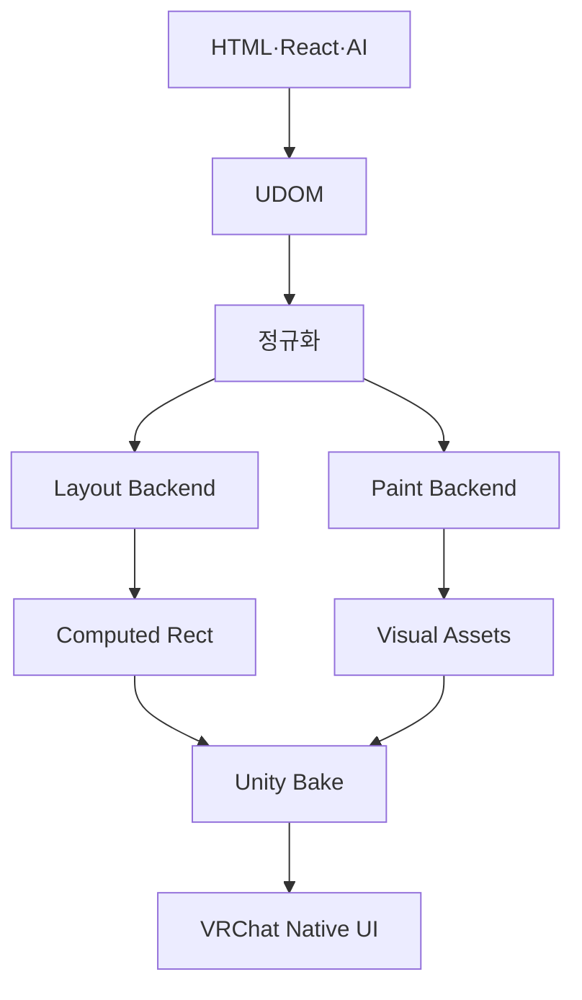

# HTML2VRC Renderer

> UDOM으로 표현된 웹 UI의 의미를 여러 레이아웃·그래픽 라이브러리로 해석하고, VRChat에서 실행 가능한 Unity 네이티브 UI로 Bake한다.

상태: 설계  
문서 버전: 0.2  
작성일: 2026-07-27

---

## 1. 목적

HTML2VRC Renderer는 브라우저 렌더러를 새로 만드는 시스템이 아니다.

UDOM 0.1로 표현된 레이아웃과 시각 의미를 해석하고, 각 표현에 적합한 기존 오픈소스 라이브러리와 Unity 기능을 조합해 VRChat 네이티브 결과물을 생성한다.

렌더러의 핵심 책임은 다음과 같다.

- UDOM의 레이아웃과 시각 속성을 해석한다.
- UDOM 버전, 트리, 참조, 확장과 Binding을 검증한다.
- 표현마다 적절한 렌더링 백엔드를 선택한다.
- 지원되지 않는 표현에는 예측 가능한 폴백을 적용한다.
- PC를 기준 결과로 생성하고, Android/Quest에서는 의미를 유지하며 심미 효과를 단계적으로 낮춘다.
- 결과를 Unity UI, TextMeshPro, Mesh, Material, Shader와 Texture로 Bake한다.
- VRChat에서 허용되지 않는 일반 스크립트와 네이티브 플러그인을 최종 월드에 남기지 않는다.
- 같은 입력과 같은 설정에서 같은 Unity 결과를 생성한다.
- 사람이 이해하고 AI가 수정할 수 있는 진단을 제공한다.

## 2. 핵심 원칙

### UDOM은 구현 라이브러리를 모른다

UDOM은 `YogaNode`, `UIEffectGradient` 같은 구현체 이름을 표현하지 않는다.

UDOM에는 웹과 가까운 의미만 남긴다.

- 순서가 있는 Element와 Text 트리
- 안정적인 Node, Style과 Resource ID
- Viewport와 명시적인 좌표계
- Absolute와 Flex Layout
- 구조화된 Background, Gradient, Border, Radius와 Shadow
- Transform operation
- Text, Image, Control, Scroll과 Embed
- 상징적인 `bind`와 `on`
- `extensions`와 `extras`

어떤 라이브러리로 표현할지는 Unity Renderer가 결정한다. 이 경계를 지키면 백엔드가 교체되어도 UDOM, React SDK와 AI 프롬프트는 바뀌지 않는다.

### 레이아웃과 페인트를 분리한다

레이아웃은 요소가 차지할 사각형을 계산한다. 페인트는 계산된 사각형 안에 색상, 모서리, 테두리, 그림자와 이미지를 그린다.

### 네이티브 우선, 부분 폴백

화면 전체를 이미지로 만드는 것은 마지막 폴백이다.

텍스트, 패널, 컨트롤처럼 가까이 보거나 자주 바뀌는 요소는 가능한 Unity에서 직접 렌더링한다. 사진, 일러스트와 네이티브로 표현하기 어려운 장식만 Texture로 유지한다.

### 의미와 심미 효과를 구분한다

구조, 텍스트, 이미지, 컨트롤, Binding과 스크롤은 UI의 의미다. Gradient, blur, glow, 복잡한 shadow와 backdrop filter는 대체로 심미 효과다.

PC 프로파일은 UDOM의 시각 의미를 가능한 충실하게 표현한다. Android/Quest 프로파일은 심미 효과의 완전한 지원을 목표로 하지 않으며, 구조와 인터랙션을 유지한 채 비용이 큰 효과를 단순화하거나 제거할 수 있다.

### 최종 결과는 라이브러리 런타임에 의존하지 않는다

외부 라이브러리의 Editor 도구, 일반 `MonoBehaviour`와 네이티브 플러그인은 제작 과정에서 사용할 수 있다.

하지만 Bake가 끝난 결과에는 VRChat에서 사용할 수 있는 다음 자산만 남기는 것을 원칙으로 한다.

- 허용된 Unity UI 컴포넌트
- TextMeshPro
- Material과 Shader
- Mesh, Sprite와 Texture
- Animator
- Udon과 UdonSharp 결과물
- 허용된 VRChat 컴포넌트

## 3. 렌더링 단계

### 입력 검증과 해석

Renderer는 HTML이나 CSS를 입력으로 받지 않는다. Skill 또는 React SDK가 CSS 단위, cascade, shorthand와 색상을 UDOM 0.1 형식으로 정규화해야 한다.

Renderer는 다음 순서로 UDOM을 해석한다.

1. `asset.version`과 `asset.minVersion` 호환성 확인
2. `extensionsUsed`와 `extensionsRequired` 확인
3. Node, Style과 Resource ID의 유일성과 참조 확인
4. UDOM 기본값 적용
5. `styleRefs`를 배열 순서대로 병합
6. Inline `style` 적용
7. Element 속성, Binding과 이벤트 slot 검증

UDOM에 허용되지 않는 CSS 문자열이나 알 수 없는 핵심 속성이 들어오면 Renderer가 의미를 추측하지 않고 오류를 생성한다. `extras`는 렌더링 결과에 영향을 주지 않으며, 알 수 없는 optional extension은 무시할 수 있지만 진단하는 것을 권장한다.

### 레이아웃 계산

각 노드의 최종 위치와 크기를 계산한다.

초기에는 다음 레이아웃 모드를 다룬다.

| 모드 | 기본 백엔드 | 용도 |
|---|---|---|
| `absolute` | HTML2VRC Core | 자식의 X/Y와 크기를 직접 배치 |
| `flex` | Yoga | UDOM FlexContainer와 FlexItem 계산 |
| `none` | 없음 | 노드와 하위 트리를 렌더링에서 제외 |

`position: absolute`인 노드는 부모 Flex 흐름에서 제외한다. 이미지·AI 기반 포팅에서 계산된 좌표도 별도의 Precomputed 모드가 아니라 UDOM의 `absolute` Layout으로 표현한다.

### 페인트 선택

정규화된 시각 속성과 플랫폼 설정을 보고 백엔드를 선택한다.

선택 기준은 다음과 같다.

- 표현 가능 여부
- VRChat 호환성
- PC 기준 시각 충실도
- Android/Quest 프로파일의 효과 예산
- Material과 draw call 비용
- 투명도와 fill rate
- Mask와 ScrollView 호환성
- Unity 버전
- 결과의 수정 가능성

### Unity Bake

계산된 레이아웃과 시각 자산을 Unity 계층으로 만든다.

외부 라이브러리 컴포넌트를 사용했다면 필요한 결과를 Material, Mesh, Texture 또는 RectTransform 값으로 저장하고 최종 계층에서 제거한다.

### 검증

Bake 결과를 다음 관점에서 검사한다.

- 허용되지 않은 컴포넌트 잔존
- 누락된 Shader, Material, Font와 Texture
- 지원되지 않는 플랫폼 표현
- Mask와 Stencil 문제
- 과도한 Material 인스턴스
- 투명 UI의 과도한 중첩
- 폴백으로 인한 텍스트 래스터화
- 동일 입력의 재생성 안정성
- UDOM 0.1 기본값과 Style 병합 결과
- 왼쪽 위 원점과 Y축 아래 방향 변환
- 시계 방향 회전과 Transform operation 순서
- Viewport `fit` 결과
- 존재하지 않는 Resource, Style과 Binding 참조
- required extension 지원 여부

### 좌표계와 Viewport

Renderer는 UDOM 좌표계를 그대로 공개 계약으로 사용한다.

- 원점은 왼쪽 위다.
- X축은 오른쪽, Y축은 아래쪽이 양수다.
- 양의 회전은 화면을 바라볼 때 시계 방향이다.
- Transform은 `operations` 배열 순서대로 적용한다.
- 단위 없는 숫자는 design unit이며 device pixel이 아니다.
- Percentage는 부모의 대응 축을 기준으로 계산한다.

Viewport의 `contain`, `cover`, `stretch`, `none`을 Canvas 배치로 변환하고, 변환 이후에도 Node ID와 계산 Rect를 진단에서 추적할 수 있어야 한다.

### 핵심 Element 매핑

| UDOM Element | Unity 기본 출력 |
|---|---|
| `view` | RectTransform과 필요한 Graphic |
| `image` | Image 또는 RawImage와 Resource |
| `button` | Button과 사용자 정의 자식 시각 구조 |
| `toggle` | Toggle과 boolean Binding |
| `slider` | Slider와 numeric Binding |
| `text-input` | TMP_InputField |
| `scroll` | ScrollRect와 콘텐츠 컨테이너 |
| `embed` | 외부 GameObject Binding 지점 |
| TextNode | TextMeshProUGUI |

컨트롤에 자식이 있으면 자식 트리를 사용자 정의 시각 구조로 사용한다. 자식이 없을 때만 Renderer 프로파일의 기본 시각 구조를 제공할 수 있다.

`bind`와 `on`의 값은 상징적인 ID다. Renderer는 이를 GameObject 경로나 Udon 메서드 이름으로 추측하지 않고, 별도의 Binding manifest에서 실제 대상을 찾는다.

### Resource와 확장

Resource는 문자열 ID로 참조하며 UDOM 파일 기준 URI를 사용한다. Image의 원본 `width`와 `height`가 있으면 고유 크기와 aspect ratio 계산에 사용한다.

Renderer는 `extensionsRequired`에 지원하지 않는 확장이 있으면 실패해야 한다. Optional extension은 무시할 수 있지만, 그 결과 시각 의미가 달라지면 반드시 폴백 진단을 남긴다. `extras`에 렌더링에 필요한 데이터가 있다고 추측해서는 안 된다.

## 4. Yoga 레이아웃 백엔드

Yoga는 UI를 그리는 라이브러리가 아니라 박스의 위치와 크기를 계산하는 Flexbox 레이아웃 엔진이다.

HTML2VRC에서는 Yoga가 UDOM의 Flex 레이아웃을 계산하고, 그 결과를 `RectTransform`에 Bake한다.

### 후보 구성

- Yoga: MIT
- `gilzoide/unity-flex-ui`: Unlicense

`unity-flex-ui`는 Yoga를 Unity UI와 연결하고 Edit Mode 갱신을 지원하므로 초기 통합의 좋은 출발점이다.

### 지원하기 좋은 범위

- flex direction
- flex wrap
- grow, shrink와 basis
- justify content
- align items, align self와 align content
- gap
- margin, padding과 border 폭
- width와 height
- min/max size
- percentage
- flow와 absolute position
- aspect ratio

### 별도 처리가 필요한 범위

- CSS Grid
- table layout
- `calc()`
- `em`, `rem`, `vw`, `vh`
- min-content와 max-content
- 브라우저와 동일한 텍스트 줄바꿈
- 복잡한 containing block 규칙

`px`, `em`, `rem`, `vw`, `vh`, `calc()`와 CSS Grid는 UDOM 0.1 입력이 아니다. 이런 값이 남아 있으면 Renderer가 변환을 시도하지 않고 Synthesizer가 수정할 수 있는 진단을 생성한다.

### 웹 기본값과의 차이

Yoga의 기본값은 브라우저 CSS와 일부 다르다. `UseWebDefaults`를 사용하더라도 모든 차이가 사라지지는 않는다.

HTML2VRC는 다음 원칙을 따른다.

- UDOM의 기본 스타일을 명시적으로 정의한다.
- Yoga의 암묵적인 기본값에 의존하지 않는다.
- 웹 기준 fixture와 계산 결과를 비교한다.
- 차이가 의도된 것인지 진단에 기록한다.

### 고유 크기 측정

Flexbox가 텍스트와 이미지의 크기를 계산하려면 콘텐츠 측정이 필요하다.

- 텍스트는 TextMeshPro의 preferred size를 사용한다.
- 이미지는 원본 크기와 aspect ratio를 사용한다.
- Embed는 UDOM 또는 Binding에 지정된 최소 크기를 사용한다.
- 측정에 필요한 Font나 Asset이 없으면 추측하지 않고 진단한다.

### Bake 원칙

Yoga와 `FlexLayout`은 Editor에서 레이아웃을 계산하는 데 사용한다.

계산 후에는 최종 좌표와 크기를 `RectTransform`에 저장하고, VRChat에서 허용되지 않는 레이아웃 보조 컴포넌트와 네이티브 플러그인 의존성을 제거한다.

World Space Canvas는 일반적으로 실행 중 화면 크기가 바뀌지 않으므로 정적 Bake와 잘 맞는다. 반응형 UI가 필요하면 런타임 Yoga보다 미리 계산한 breakpoint 변형이나 Unity의 허용된 Layout 컴포넌트를 우선한다.

## 5. 페인트 백엔드 후보

하나의 라이브러리가 모든 CSS 표현을 담당하도록 강제하지 않는다.

| 후보 | 라이선스 | 주요 역할 | 사용 방향 |
|---|---|---|---|
| UIEffect v5 | MIT | 선형·방사형·각도 gradient, shadow, outline, blur | 주요 Shader·Effect 소스 |
| Unity-UI-Rounded-Corners | MIT | 전체·모서리별 radius, Mask | 주요 Radius 소스 |
| unity-gradient-rect | Unlicense | Mesh vertex gradient | 단순 Gradient 소스 |
| Unity-UIGradient | MIT | 2색·꼭짓점 gradient | 경량 구현 참고 |
| UI Shapes Kit | MIT | 절차적 도형, 선, shadow와 glow | 선택적 Geometry 소스 |
| RmlUi | MIT | CSS Paint 규칙과 gradient 파라미터 | 알고리즘·테스트 참고 |
| ReactUnity Core | MIT | CSS 값과 Unity 표현의 매핑 | 구조·정규화 참고 |

### UIEffect

UIEffect는 현재 가장 넓은 페인트 기능을 제공하는 후보다.

- horizontal, vertical, diagonal과 angle gradient
- radial gradient
- 다중 color stop
- shadow와 outline
- blur와 색상 효과
- TextMeshPro, VR와 Unity 6 지원

다만 UIEffect 컴포넌트를 최종 월드에 그대로 남기지 않는다. 필요한 Shader 기능과 데이터를 HTML2VRC Material로 Bake하거나, 호환 가능한 부분만 소스 수준에서 통합한다.

### Unity-UI-Rounded-Corners

패널과 버튼의 `border-radius`를 텍스처 없이 표현하는 기본 후보다.

- 크기 변화에 독립적인 radius
- 모서리별 radius
- Unity Mask
- Tint

HTML2VRC는 이 구현을 Material 기반으로 사용할 수 있는지 검증하고, 보조 컴포넌트가 필요하다면 Bake 후 제거한다.

### unity-gradient-rect

단순한 선형 gradient를 Mesh의 vertex color로 표현한다. 전체 패널을 Texture로 굽지 않으므로 해상도에 독립적이고 Shader 복잡도도 낮다.

임의 각도, radial, conic 또는 복잡한 color stop에는 다른 백엔드를 사용한다.

### RmlUi와 ReactUnity

두 프로젝트를 최종 런타임으로 포함하지 않는다.

RmlUi에서는 CSS gradient와 Paint 명령의 의미, color stop 보정과 렌더러 기능 분리를 참고한다.

ReactUnity에서는 CSS 값 정규화, 속성 매핑, uGUI와 UI Toolkit 백엔드 구성을 참고한다.

## 6. 기본 백엔드 선택 규칙

| UDOM 표현 | PC 우선 백엔드 | PC 폴백 | Android/Quest 기본 |
|---|---|---|---|
| Color background | Unity Image | 공용 Material | 동일 |
| 2색 linear gradient | Gradient LUT Material (Unity 프로토타입 구현) | UIEffect 기반 Material | 단색 |
| 다중·임의 각도 linear gradient | Gradient LUT Material (Unity 프로토타입 구현) | Gradient LUT | 단순 Gradient 또는 단색 |
| radial gradient | Radial Gradient LUT Material (Unity 프로토타입 구현) | Gradient LUT | 단순 Gradient 또는 단색 |
| conic gradient | Conic Gradient LUT Material (Unity 프로토타입 구현) | 부분 이미지 | 단색 또는 비활성화 |
| border radius | SDF Rounded Corners Material (Unity 프로토타입 구현) | 9-slice | Material 또는 9-slice |
| 단순 border | Material 또는 추가 Image | 9-slice | 동일 |
| 단순 shadow | UIEffect 또는 복제 Image | 부분 이미지 | 축소하거나 비활성화 |
| blur shadow | UIEffect | 부분 이미지 | 기본 비활성화 |
| 사진·일러스트 | Sprite 또는 Texture | Atlas | 압축 Texture |
| TextNode | TextMeshPro | 별도 Font 폴백 | TextMeshPro |

폴백은 조용히 발생하지 않는다. 결과의 수정 가능성이나 선명도가 달라지면 경고 또는 정보 진단을 남긴다.

한 Element의 `backgrounds`는 배열 앞에서 뒤로, 아래에서 위로 합성한다. 각 Background layer는 독립적으로 백엔드를 선택할 수 있지만 최종 순서와 opacity는 유지해야 한다.

### 선택적 시각 확장: backdrop filter

Backdrop filter는 UDOM 0.1 핵심 속성이 아니다. 도입한다면 `H2VRC_backdrop_filter` 같은 optional extension으로 정의하고 `extensionsUsed`에 기록한다.

Backdrop blur는 뒤에 있는 화면을 다시 읽고 필터링해야 하므로 일반적인 Gradient나 Shadow보다 비용과 플랫폼 차이가 크다. 다음 순서로 우아하게 성능을 낮춘다.

1. PC에서 지원 backend로 실시간 효과를 렌더링한다.
2. 뒤의 콘텐츠가 정적이면 해당 영역만 미리 Bake한 이미지로 대체한다.
3. Blur 강도와 sample 수를 낮추고 반투명 배경색을 강화한다.
4. 효과를 제거하되 UDOM의 기존 Background, Border와 콘텐츠는 유지한다.

Android/Quest에서는 실시간 backdrop sampling과 blur를 기본적으로 지원하지 않는다. 정적 부분 이미지도 명시적인 opt-in과 예산 검증이 있을 때만 사용하고, 기본 폴백은 filter 제거와 반투명 Background 유지다.

Backdrop filter가 문서 해석에 필수라면 `extensionsRequired`에 넣을 수 있다. 이 경우 해당 확장을 지원하지 않는 Android/Quest 빌드는 시각을 임의로 바꾸지 않고 실패해야 한다.

## 7. 플랫폼 품질 정책

### PC가 기준 결과다

HTML2VRC Renderer의 기준 시각 결과와 비교 fixture는 PC 프로파일을 사용한다.

- 새 Paint backend는 먼저 PC에서 충실도를 검증한다.
- UDOM의 시각 의미를 Android/Quest의 최저 공통 기능으로 제한하지 않는다.
- HMR 또는 원본 웹과의 이미지 비교도 PC 결과를 기준으로 한다.
- Material, Shader와 효과 선택은 프로파일에 포함해 결정성을 유지한다.

### Android/Quest는 의미를 보존한다

Android/Quest 출력이 요청되면 다음은 유지해야 한다.

- Element와 Text 트리
- Layout과 콘텐츠 순서
- Text와 Image 정보
- Button, Toggle, Slider, Input과 Scroll 인터랙션
- Binding과 Embed 연결
- 클릭 영역과 visibility

반면 다음 심미 효과는 모바일 호환성 요구 사항이 아니다.

- backdrop blur
- 일반 blur와 glow
- 복잡한 다중 shadow
- 고비용 conic 또는 다중 effect 조합
- 중첩 투명 레이어와 고비용 blend

Radius, 단순 Gradient와 단순 Shadow처럼 비용이 낮은 효과는 backend가 지원하면 유지할 수 있다. 모바일에서 심미 효과를 제거하더라도 콘텐츠를 함께 제거하거나 전체 화면을 저해상도 Texture로 바꾸면 안 된다.

### 성능 저하 단계

각 Paint backend는 플랫폼별로 다음 단계를 선언한다.

| 단계 | 결과 |
|---|---|
| Exact | PC 기준과 같은 의미와 품질 |
| Reduced | 같은 효과를 낮은 sample, stop 또는 layer 수로 표현 |
| Approximate | 단순 Gradient, 단색, 9-slice 또는 정적 부분 이미지로 대체 |
| Disabled | 장식 효과만 제거하고 기본 Background와 콘텐츠 유지 |
| Unsupported | UI 의미를 유지할 수 없어 빌드 실패 |

Renderer는 선택한 단계와 손실된 속성을 Node ID 단위로 진단한다.

## 8. VRChat 호환 경계

VRChat 월드는 허용 목록에 없는 일반 스크립트를 실행하지 않는다.

따라서 렌더링 라이브러리는 다음 두 영역으로 구분한다.

### Editor 영역

- UDOM JSON과 Schema 검증
- 버전, 확장과 참조 해석
- Yoga 레이아웃 계산
- 외부 패키지의 보조 컴포넌트
- Shader와 Material 생성
- Mesh와 Texture Bake
- 비교 렌더링과 진단

### 월드 영역

- 허용된 Unity UI
- TextMeshPro
- Shader와 Material
- Sprite, Mesh와 Texture
- Animator
- Udon
- Embed로 연결된 허용 오브젝트

Android/Quest 월드는 커스텀 월드 Shader를 사용할 수 있지만 투명도와 중첩된 UI는 fill rate 비용이 크다. 따라서 PC 기준 결과를 유지하려고 무리하지 않고, 플랫폼 품질 정책에 따라 장식 효과를 낮춘다.

## 9. 라이선스 정책

HTML2VRC는 상업적 사용, 수정과 재배포가 가능한 permissive 라이선스의 라이브러리를 사용할 수 있다.

기본 허용 후보는 다음과 같다.

- MIT
- BSD-2-Clause와 BSD-3-Clause
- Apache-2.0
- ISC
- Zlib
- 0BSD
- Unlicense
- CC0

다음은 초기 기본 의존성에서 제외하거나 별도 검토한다.

- GPL과 AGPL
- LGPL 런타임 의존성
- MPL의 수정 파일 공개 의무가 적용되는 통합
- 비상업용 또는 사용 분야 제한 라이선스
- 재배포가 제한된 Asset Store 자산
- 소스는 공개되어 있지만 라이선스가 명확하지 않은 프로젝트

라이브러리를 채택할 때는 저장소 상단의 라이선스 표시만 확인하지 않는다.

- 정확한 LICENSE 전문 확인
- 포함된 하위 의존성과 에셋의 라이선스 확인
- 사용한 버전 또는 commit 고정
- 원본 copyright와 라이선스 고지 보존
- 수정하거나 가져온 파일의 출처 기록
- Third Party Notices 유지

Unlicense도 허용한다. 다만 법적 문구와 특허 허여의 명확성이 중요한 경우 MIT, BSD 또는 Apache-2.0 구현을 우선할 수 있다.

## 10. AI 친화적 설계

AI는 특정 Unity 라이브러리 API보다 HTML, CSS, React와 일반적인 Unity 개념을 더 안정적으로 생성한다.

따라서 AI는 UDOM 0.1의 명시적인 속성만 생성한다. CSS 문자열, Yoga, UIEffect나 Rounded Corners의 선택과 설정은 UDOM에 넣지 않으며, backend 선택은 결정론적인 C# Renderer가 담당한다.

이 구조의 장점은 다음과 같다.

- AI 프롬프트가 특정 라이브러리 버전에 종속되지 않는다.
- 렌더링 백엔드를 교체해도 UDOM을 다시 만들 필요가 없다.
- 잘못된 라이브러리 API 생성과 환각을 줄인다.
- AI 없이도 UDOM에서 Unity까지 재생성할 수 있다.
- 진단 문맥만 AI에 전달해 수정안을 받을 수 있다.

### 렌더링 진단

렌더링 오류와 폴백에는 가능한 범위에서 다음 정보를 포함한다.

| 문맥 | 예시 |
|---|---|
| 오류 코드 | `H2VRC-PAINT-004` |
| UDOM 위치 | JSON Pointer, node ID와 계층 경로 |
| 입력 속성 | 실제 UDOM 값과 적용된 기본값 |
| 해석 결과 | 계산된 Rect, Style 병합과 Resource 참조 |
| 선택 백엔드 | Yoga, UIEffect, Vertex 또는 Texture |
| 선택 이유 | 기능, PC/Android 프로파일 또는 성능 조건 |
| 폴백 결과 | 유지되거나 손실된 시각 의미 |
| 해결 제안 | 단순화, 대체 속성 또는 Embed |
| 환경 | HTML2VRC, Unity, VRCSDK와 플랫폼 |

예:

> `/root/children/2/style/layout/width`의 값 `100vw`는 UDOM 0.1 Length가 아닙니다. Synthesizer에서 design unit 또는 percentage로 정규화해야 합니다.

> `hero-gradient`의 6개 color stop을 Vertex backend가 표현할 수 없어 UIEffect backend를 선택했습니다.

> `glass-panel`의 `H2VRC_backdrop_filter`는 Android/Quest에서 Disabled 단계가 적용되었습니다. Filter는 제거하고 반투명 Background와 Border는 유지했습니다.

## 11. 결정성

결정적인 UDOM → Unity 변환을 위해 다음을 고정한다.

- UDOM `version`과 `minVersion`
- required extension과 구현 버전
- 렌더러 설정
- 라이브러리와 Shader 버전
- Font와 Asset 참조
- 디자인 좌표계
- 목표 플랫폼
- 품질 프로파일과 degradation 단계
- 단위와 반올림 규칙
- backend 선택 우선순위

렌더러는 자동 업데이트된 외부 패키지의 동작에 결과를 맡기지 않는다. 채택한 버전을 고정하고, 업데이트 시 기준 fixture를 다시 비교한다.

동일 입력에서 결과가 달라지는 변경은 문서화하고 필요한 경우 렌더러 또는 UDOM 버전을 올린다.

## 12. 품질과 성능

시각적 표현을 네이티브화하는 것만으로 충분하지 않다. VR 환경에서는 가까이 보이는 UI의 선명도와 동시에 draw call, 투명도와 Material 수를 관리해야 한다.

주요 기준은 다음과 같다.

- 텍스트를 화면 전체 Texture에 포함하지 않는다.
- 같은 스타일은 가능한 Material을 공유한다.
- 단순 gradient는 복잡한 Shader보다 vertex color를 우선한다.
- 다중 color stop은 작은 Gradient LUT를 사용할 수 있다.
- 전체 패널 Texture Bake보다 부분 장식 Bake를 우선한다.
- 투명 패널의 중첩을 줄인다.
- PC를 품질 기준으로 삼고 Android/Quest 프로파일을 별도로 생성한다.
- Android/Quest 때문에 PC의 UDOM 표현 범위를 제한하지 않는다.
- 모바일에서 장식을 제거해도 Layout, Text와 인터랙션은 유지한다.
- Mask와 Shadow가 만드는 추가 draw call을 진단한다.
- HMR 미리보기와 Unity 결과를 기준 이미지로 비교한다.

목표는 브라우저와 100% 같은 픽셀이 아니라, 웹 UI의 구조와 시각적 정체성을 VR에서 선명하고 안정적으로 재현하는 것이다.

## 13. Unity 버전 전략

현재 VRChat이 사용하는 Unity 2022.3.22f1 환경을 공식 기준으로 삼는다.

| 환경 | 지원 수준 |
|---|---|
| VRChat 지정 Unity 2022.3.22f1 | 필수 지원 |
| Unity 6 LTS | 조기 호환성 테스트 |
| Unity 6 기반 VRChat SDK | 공개 시 공식 지원 전환 |

외부 렌더링 라이브러리는 두 Unity 계열에서 별도로 검증한다. Unity 6 전용 기능을 사용하더라도 Unity 2022 경로를 제거하지 않는다.

## 14. 개발 순서

### 1단계: 렌더러 경계

- UDOM 0.1 버전, 트리, ID와 참조 검증
- Style 기본값, `styleRefs`와 inline 병합
- Viewport, 좌표계와 Transform 변환
- 핵심 Element와 Binding manifest
- Absolute Layout
- 단색 Image, Texture와 TextMeshPro
- backend 선택과 진단
- VRChat 허용 컴포넌트 검사

### 2단계: Flexbox

- Yoga와 `unity-flex-ui` 검증
- TextMeshPro와 이미지 측정
- RectTransform Bake
- 웹 fixture와 레이아웃 비교
- 외부 컴포넌트 제거 검증

### 3단계: 선명한 패널

- 다중·임의 각도 linear gradient (VRChat-safe LUT Material 구현)
- radial gradient (VRChat-safe elliptical LUT Material 구현)
- conic gradient (VRChat-safe clockwise LUT Material 구현)
- per-corner border radius (VRChat-safe SDF Material + stencil Mask 구현)
- per-edge border (outer radius clip 구현, 정확한 inner border contour는 후속)
- Mask와 ScrollView 조합

### 4단계: 장식과 폴백

- shadow와 outline
- blur
- Gradient LUT 품질·성능 프로파일 확장
- 부분 Texture Bake
- PC 기준 프로파일
- Android/Quest degradation 단계
- optional backdrop filter 확장

### 5단계: 품질 비교

- 브라우저 기준 이미지와 Unity 결과 비교
- Material과 draw call 분석
- 자주 발생하는 차이의 진단 개선
- Unity 6 호환성 검증

## 15. 초기 결정

- UDOM을 렌더링 라이브러리로부터 독립시킨다.
- Yoga는 Flexbox Layout backend로 검토한다.
- `unity-flex-ui`를 Unity 통합의 첫 참고 구현으로 사용한다.
- UIEffect를 복잡한 gradient와 effect의 주요 후보로 사용한다.
- Unity-UI-Rounded-Corners를 radius의 주요 후보로 사용한다.
- unity-gradient-rect를 단순 gradient 후보로 다시 포함한다.
- 외부 라이브러리 컴포넌트는 Editor에서 사용할 수 있지만 최종 VRChat 계층에는 남기지 않는다.
- permissive 라이선스는 MIT로 제한하지 않고 Unlicense, BSD, Apache, ISC, Zlib, 0BSD와 CC0까지 허용한다.
- 지원하지 않는 표현과 폴백은 반드시 문맥 있는 진단으로 알린다.
- PC를 시각적 기준 결과로 사용한다.
- Android/Quest에서는 UI 의미를 유지하고 심미 효과의 지원은 강제하지 않는다.
- Backdrop filter는 UDOM 0.1 핵심이 아닌 optional extension으로 검토한다.
- 모바일의 기본 backdrop filter 폴백은 효과 제거와 기존 Background 유지다.
- Unity 2022 VRChat 환경을 우선하면서 Unity 6 호환성을 지속적으로 확인한다.

## 16. 열려 있는 결정

- UIEffect 전체 의존성과 필요한 Shader 일부 통합 중 어느 쪽을 선택할 것인가?
- Rounded Corners를 표준 Image와 Material만으로 Bake할 수 있는가?
- Yoga 네이티브 플러그인을 Editor 전용으로 완전히 분리할 수 있는가?
- CSS Grid 결과를 Synthesizer가 UDOM Absolute 또는 Flex로 정규화할 것인가, 향후 확장으로 둘 것인가?
- 런타임에 내용이 달라지는 UI를 어느 범위까지 재배치할 것인가?
- Material 공유와 요소별 스타일 파라미터를 어떻게 균형 잡을 것인가?
- 각 Paint 효과의 Android/Quest degradation 단계를 어떤 예산으로 결정할 것인가?
- `H2VRC_backdrop_filter` 확장의 정확한 속성과 정적 여부를 어떻게 표현할 것인가?
- 브라우저와 Unity의 시각 차이를 어떤 fixture와 허용 오차로 검증할 것인가?

이 결정들은 UDOM의 공개 의미를 바꾸지 않는 범위에서 실험하고 교체할 수 있어야 한다.

## 17. 참고 자료

기술 검토 시 원본 저장소와 공식 문서를 기준으로 삼는다.

- [VRChat Current Unity Version](https://creators.vrchat.com/sdk/upgrade/current-unity-version/)
- [UDOM 0.1 초기 명세](../udom/SPECIFICATION.md)
- [Yoga](https://github.com/facebook/yoga)
- [unity-flex-ui](https://github.com/gilzoide/unity-flex-ui)
- [UIEffect](https://github.com/mob-sakai/UIEffect)
- [Unity-UI-Rounded-Corners](https://github.com/kirevdokimov/Unity-UI-Rounded-Corners)
- [unity-gradient-rect](https://github.com/gilzoide/unity-gradient-rect)
- [Unity-UIGradient](https://github.com/azixMcAze/Unity-UIGradient)
- [UI Shapes Kit](https://github.com/thisotherthing/ui-shapes-kit)
- [RmlUi](https://github.com/mikke89/RmlUi)
- [ReactUnity Core](https://github.com/ReactUnity/core)

의존성을 채택할 때는 이 문서의 라이선스 표기만 신뢰하지 않고, 고정할 버전의 LICENSE와 하위 의존성을 다시 검토한다.
